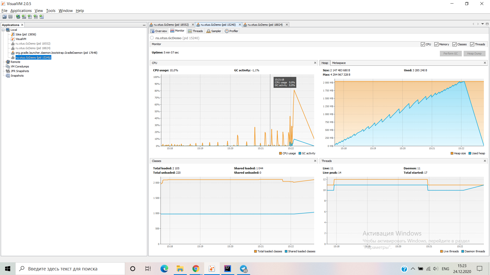
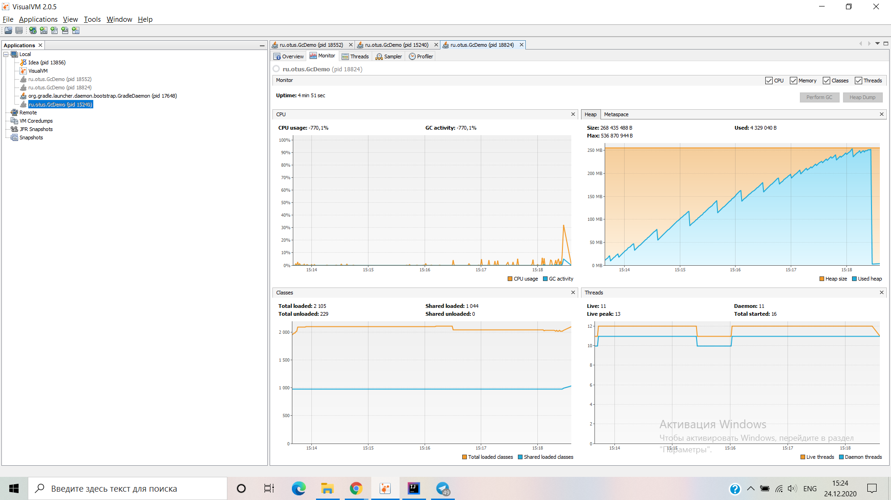

## Уронить за 300 секунд

name| memory  |stop the world| capacity | minor | major | total working time GC ms
----|------------|------|---------|----|------ | -----
G1| 2 GB | 4-123 ms old ~400 | `DEFAULT_G1` | 41 | 12 | 4734
G1| 256 MB | 2 -14 ms old ~55 | `G1_WITH_LOW_MEMORY`| 32 | 10 | 752
ZGC| 2 GB | 186 - 812 | `DEFAULT_ZGC` |  | 45 | 25729
ZGC| 256 MB | 35  - 107| `ZGC_WITH_LOW_MEMORY`  |  | 91 | 8426
ParallelGC | 256 MB | 8 - 59 | `PARALLEL` | 6 | 25 | 1290
ParallelGC | 2 GB |  | `PARALLEL_WITH_LOW_MEMORY` | 5 | 19 | 11308

G1 идет короткими отрывками по немного в несколько этапов старое поколение создавалось только к 
концу памяти old чистит подолгу до 400 мс.
ZGC думаю что он не сразу сохраняет объекты в кучу, а сначала кладет 
их отдельно пока не наберется какое-то количество и уже потом сохраняет все вместе, 
циклы работы дольше. На малой и средней памяти G1 явно лучше, чем меньше памяти тем больше 
рознится время и частичность остановок и эффективность сборок. Parallel мажорных сборок
было больше минорных, из этого можно думать что память молодого поколения на много меньше
и сборщик подходит для приложений с долгой жизнью объектов, упал прежде чем заполнил всю 
память
###График отношения заполняемости ко времени порядок табличный 

