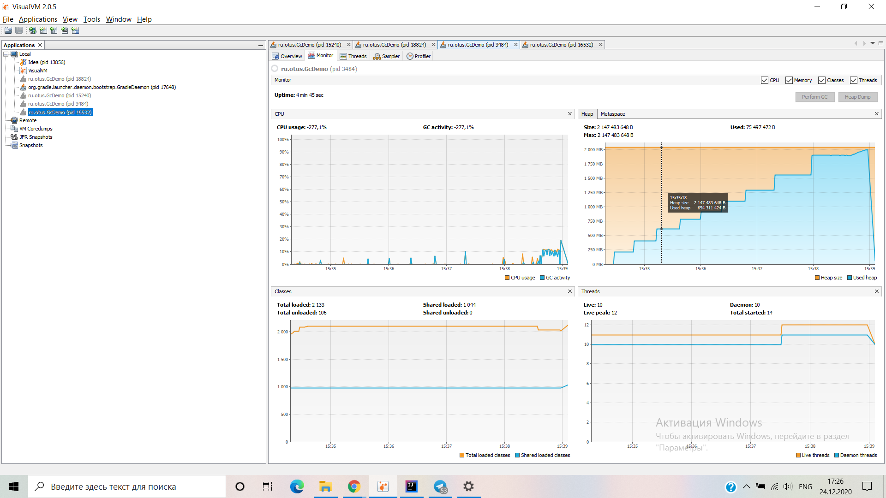

## Уронить за 300 секунд

name| memory  |stop the world| capacity | minor | major
----|------------|------|---------|----|------
G1|default - dynamically to 2GB starts from 126mb | 4-123 ms old ~400 | `DEFAULT_G1` | 22 | 4
G1| 256MB | 2 -14 ms old ~70 | `G1_WITH_LOW_MEMORY`| 20 | 5
ZGC| 2 GB | 186 - 812 | `DEFAULT_ZGC` |  | 35
ZGC| 256 MB | 35  - 107| `ZGC_WITH_LOW_MEMORY`  |  | 164

G1 идет короткими отрывками по немного в несколько этапов старое поколение создавалось только к 
концу памяти old чистит подолгу до 400 мс.
ZGC думаю что он не сразу сохраняет объекты в кучу, а сначала кладет 
их отдельно пока не наберется какое-то количество и уже потом сохраняет все вместе, 
циклы работы дольше. На малой и средней памяти G1 явно лучше, чем меньше памяти тем больше 
рознится время и частичность остановок и эффективность сборок
###График отношения заполняемости ко времени порядок табличный 

